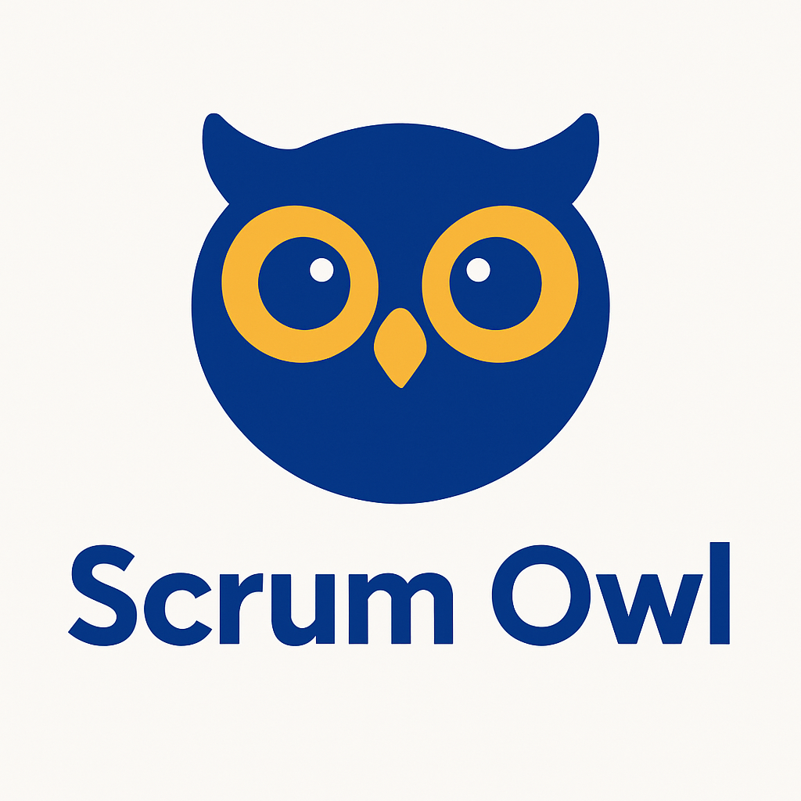

# Scrum Owl Discord Bot

A Discord bot that facilitates Planning Poker sessions for agile teams. Built with TypeScript and discord.js.

## Features

- Planning Poker: Estimate tasks with team voting
- Facilitator Selection: Randomly select a facilitator
- Reminders: Set one-time or recurring reminders

## Setup

### Prerequisites

- Node.js (v16.9.0+)
- Discord account and server

### Quick Start

1. Clone and install:

   ```
   git clone <repository-url>
   cd scrum-owl
   npm install
   ```

2. Create a Discord bot in the [Developer Portal](https://discord.com/developers/applications)
   - Enable SERVER MEMBERS INTENT and MESSAGE CONTENT INTENT
   - Copy the bot token

3. Configure environment:

   ```
   # .env file
   DISCORD_TOKEN=your_discord_bot_token
   CLIENT_ID=your_client_id
   GUILD_ID=your_guild_id
   ```

4. Deploy and start:
   ```
   npm run build
   npm run deploy
   npm start
   ```

### Docker Deployment

```
cp .env.example .env
# Edit .env with your values
docker-compose up -d
```

## Commands

### Planning Poker

```
/poker description: [item to estimate]
```

### Facilitator Selection

```
/facilitator participants: [comma-separated names]
```

Requires Backlog API configuration in .env

### Reminders

```
# One-time reminder
/reminder once channel: [channel] message: [text] date: [YYYY-MM-DD] time: [HH:MM]

# Daily reminder
/reminder daily channel: [channel] message: [text] time: [HH:MM]

# List reminders
/reminder list

# Delete reminder
/reminder delete index: [number]

# Add content to reminder
/reminder add-content index: [number] content: [text]
```

## Development

Source code is in the `src` directory. To add a new command:

1. Create a file in `src/commands/`
2. Implement the `Command` interface
3. Run `npm run deploy`

## License

ISC
