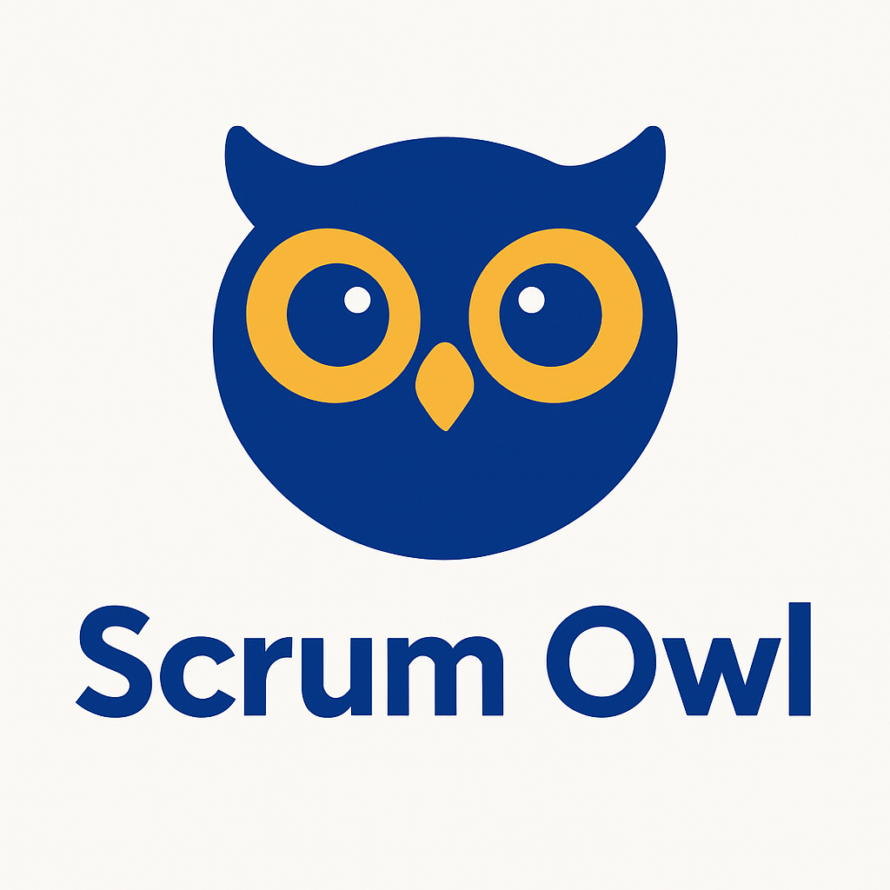

# Scrum Owl Discord Bot

A Discord bot for agile teams. Built with TypeScript and discord.js.

## Features

- **Planning Poker**: Estimate tasks with team voting
- **Rotate**: Randomly select participants, with templates and weighted selection
- **Reminders**: Set one-time or recurring reminders

## Setup

### Prerequisites

- Node.js (v16.9.0+)
- Discord account and server

### Quick Start

1. Clone and install:

   ```
   git clone <repository-url>
   cd scrum-owl
   npm install
   ```

2. Create a Discord bot in the [Developer Portal](https://discord.com/developers/applications)
   - Enable SERVER MEMBERS INTENT and MESSAGE CONTENT INTENT
   - Copy the bot token

3. Configure environment:

   ```
   cp .env.example .env
   # Edit .env with your values
   ```

4. Deploy and start:
   ```
   npm run build
   npm run deploy
   npm start
   ```

### Docker Deployment

```
cp .env.example .env
# Edit .env with your values
docker-compose up -d
```

## Commands

### Planning Poker

Start an interactive voting session for estimating a task.

```
/poker description: [item to estimate]
```

Team members vote using point values (0, 1, 2, 3, 5, 8, 13, 21, ?). After voting, use **Show Results** to reveal all votes and see the average. Use **Revote** to restart the vote, or **End Session** to close. Sessions time out after 15 minutes.

---

### Rotate

Randomly select one or more participants from a list.

#### Ad-hoc Selection

```
/rotate run participants: [comma-separated names] count: [optional]
```

- `participants`: Comma-separated list of names (e.g. `Alice, Bob, Carol`)
- `count`: Number of participants to select (default: 1)

#### Templates

Save a reusable participant list as a named template. Templates track selection history and apply weighted selection so less-frequently-chosen participants are more likely to be picked.

```
/rotate template save name: [name] participants: [comma-separated names]
```

- Template names: max 50 characters
- Participants per template: max 50

```
/rotate template use name: [name] count: [optional]
```

Runs the selection using a saved template and updates selection history.

```
/rotate template list
```

Lists all templates saved in the server.

```
/rotate template delete name: [name]
```

```
/rotate template add-member name: [name] members: [comma-separated names]
```

```
/rotate template remove-member name: [name] members: [comma-separated names]
```

Template names support autocomplete.

---

### Reminders

Create, manage, and delete reminders.

#### Creating Reminders

```
/reminder create title: [title] message: [message] time: [time] type: [once|daily]
```

**Required Parameters:**

- `title`: Title of the reminder
- `message`: Message content of the reminder
- `time`: When to trigger (e.g., `14:30`, `2h`, `2024-07-15 14:30`)
- `type`: `once` for one-time, `daily` for daily repeating

**Optional Parameters:**

- `channel`: Destination channel (defaults to current channel)
- `skip_weekends`: Skip Saturdays and Sundays for daily reminders (`true`/`false`)

**Examples:**

```
/reminder create title: "Meeting" message: "Team meeting is starting" time: "14:30" type: once

/reminder create title: "Stand-up" message: "Stand-up time" time: "09:00" type: daily skip_weekends: true channel: #dev-team
```

#### Listing Reminders

```
/reminder list
```

#### Deleting Reminders

```
/reminder delete id: [reminder_id]
```

#### Editing Reminders

```
/reminder edit id: [reminder_id]
```

Opens a modal to edit the title, message, time, and active status of an existing reminder.

---

## Development

Source code is in the `src` directory. To add a new command:

1. Create a file in `src/commands/`
2. Implement the `Command` interface
3. Run `npm run deploy`

See `CLAUDE.md` for the full development workflow.

## License

ISC
